# HeartLib v2.0


> a library management system with a heart. free. offline. privacy first. no fines. no cloud. no subscription.


## the problem this solves

librarians are overworked and underfunded. the software they are forced to use is expensive, clunky, broken, or all three. cloud based systems store patron reading habits on someone else's servers. subscription fees drain already tight budgets. most systems treat overdue books like crimes and patrons like criminals.

heartlib takes the opposite approach. everything stays local. the database lives on the library's own computer. no cloud. no telemetry. no monthly payment. the fine system is turned off by default because kindness works better than punishment.

built because libraries deserve better. librarians deserve better. patrons deserve better.


## what makes heartlib different

**no fines by default.** the system tracks due dates but does not charge late fees unless you explicitly enable them. most libraries never will.

**offline first.** the entire system works without an internet connection. no dependency on cloud servers. no downtime when the internet goes out.

**multi device sync.** connect multiple computers and tablets on the same local network. no cloud required. everything stays inside the library.

**patron self service.** patrons scan a qr code at the front desk. they can search the catalog, view their loans, and renew books from their own phones. no special app required. just a browser.

**barcode scanning.** use a usb scanner or the computer's camera. works with book isbns and library card barcodes.

**professional reports.** generate grant ready reports with circulation statistics, popular books, overdue items, and community impact summaries. export to csv for further analysis.

**fully customizable themes.** light mode. dark mode. or pick your own colors for every part of the interface. export your theme and share it with other libraries.

**free forever.** no hidden fees. no premium tier. no feature gating. heartlib is free because kindness should be free.


## what heartlib helps you do

**manage books.** add, edit, delete, search. advanced search with regex, case sensitivity, and whole word matching. track copies available versus copies checked out.

**manage patrons.** register members with name, email, phone. auto generate barcode or use your own. view active loans per patron.

**checkout and return.** set due dates. real time activity feed shows every transaction with color coding. green for checkout. blue for return. red for overdue.

**scan barcodes.** use your computer's camera. works with book isbns and patron cards. manual entry fallback when camera is unavailable.

**generate reports.** overview statistics. most popular books. overdue items list. circulation history by date range. grant ready professional reports.

**import and export csv.** migrate from legacy systems. backup your data. batch operations across hundreds of records.

**sync across devices.** one server, many clients. works over local wifi or ethernet. no internet required. conflict detection with manual resolution.

**serve patrons via pwa.** installable on any smartphone. search catalog. view loans. renew books. dark light theme. english, spanish, french. push notifications for due dates.


## screenshots


<table>
    <tr>
        <td>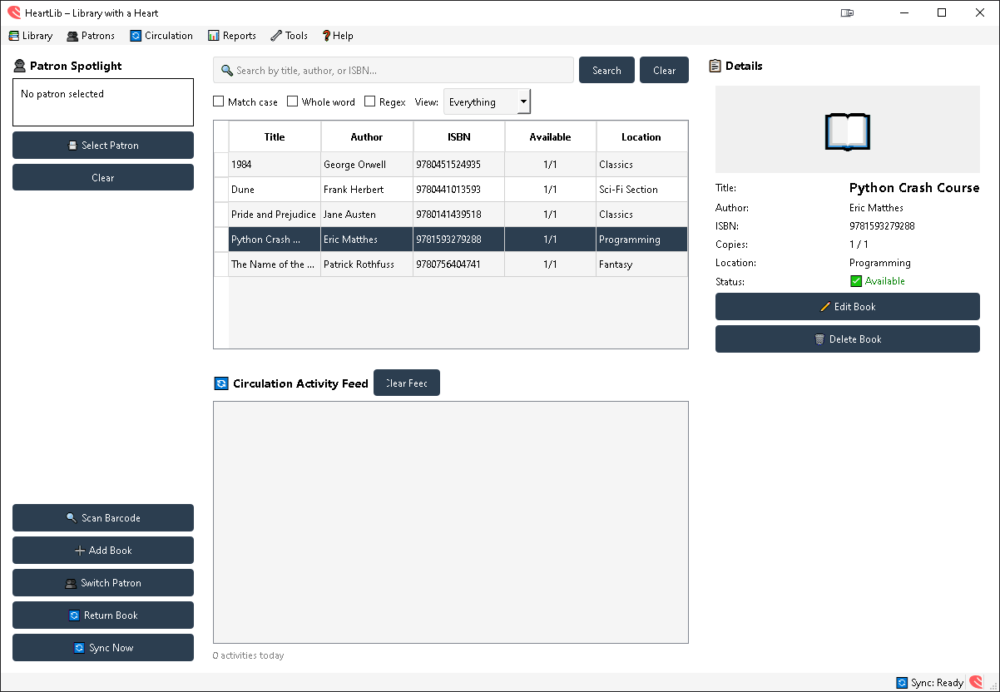</td>
        <td>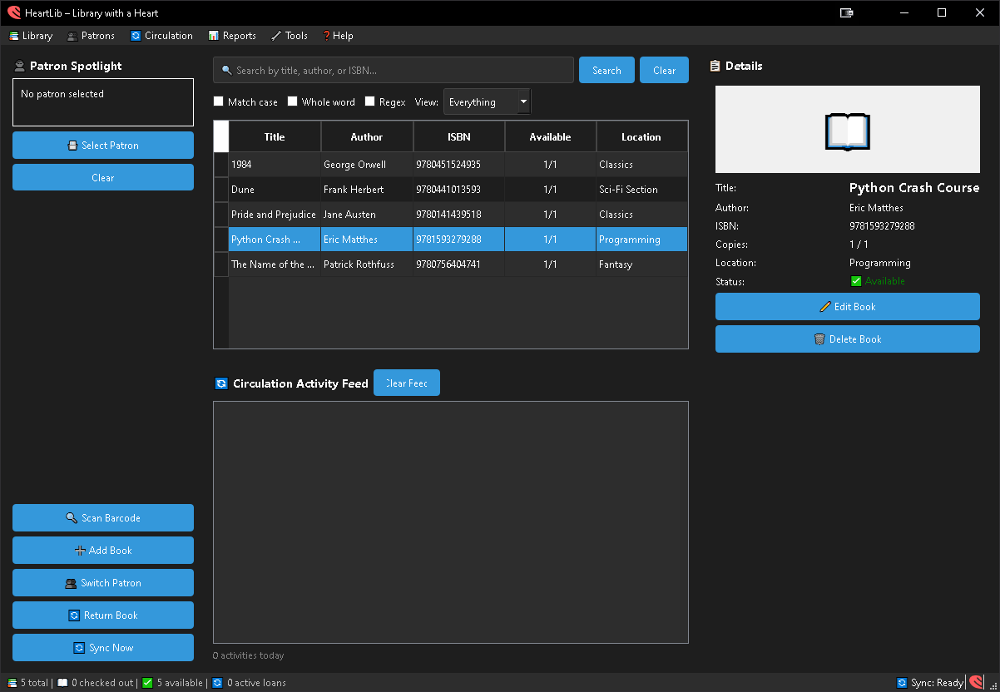</td>
    </tr>
    <tr>
        <td>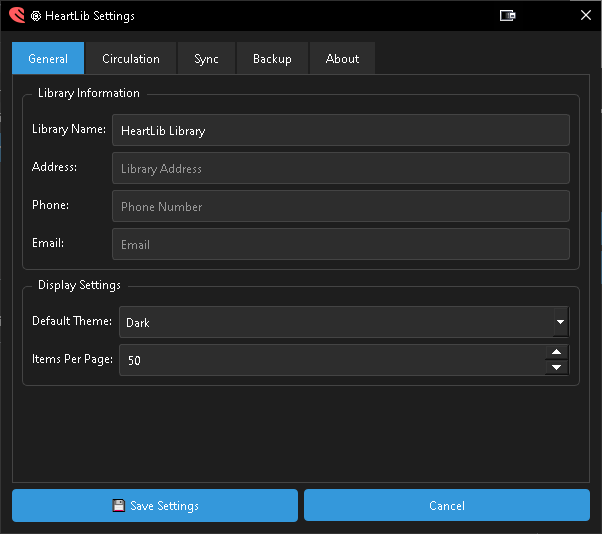</td>
        <td>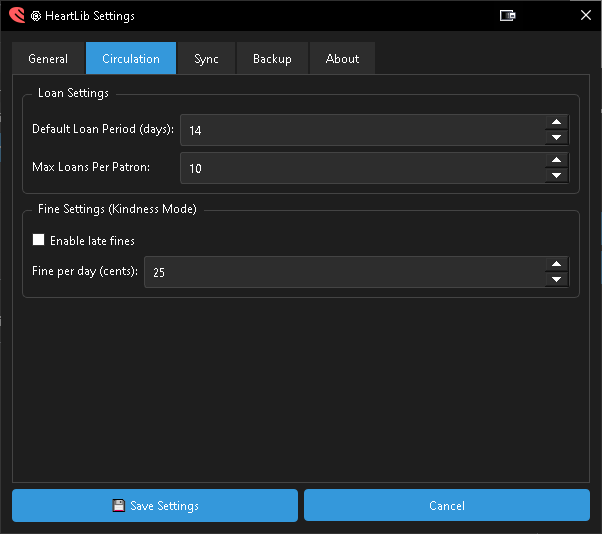</td>
    </tr>
    <tr>
        <td>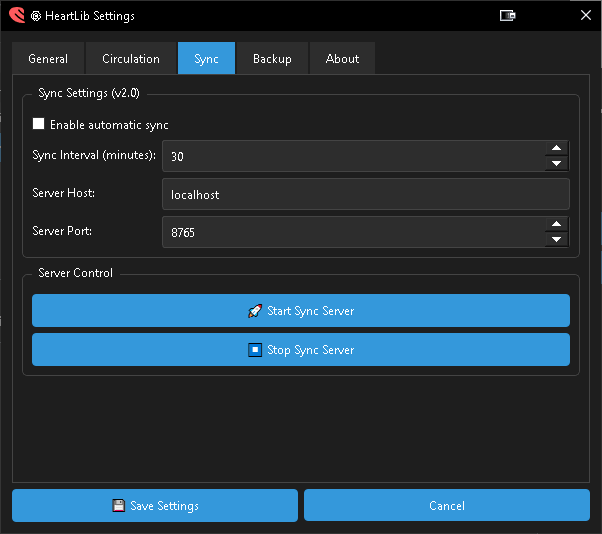</td>
        <td>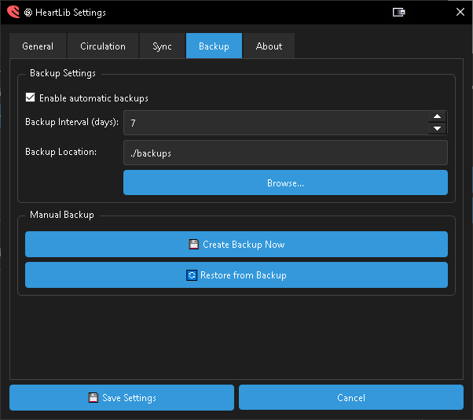</td>
    </tr>
    <tr>
        <td>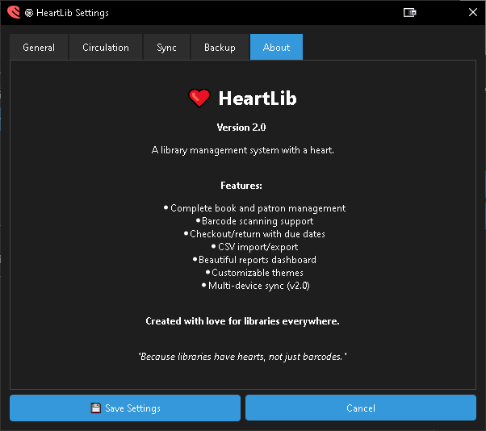</td>
        <td>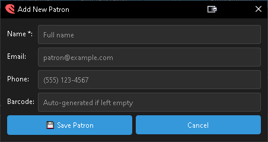</td>
    </tr>
    <tr>
        <td></td>
        <td></td>
    </tr>
    <tr>
        <td></td>
        <td>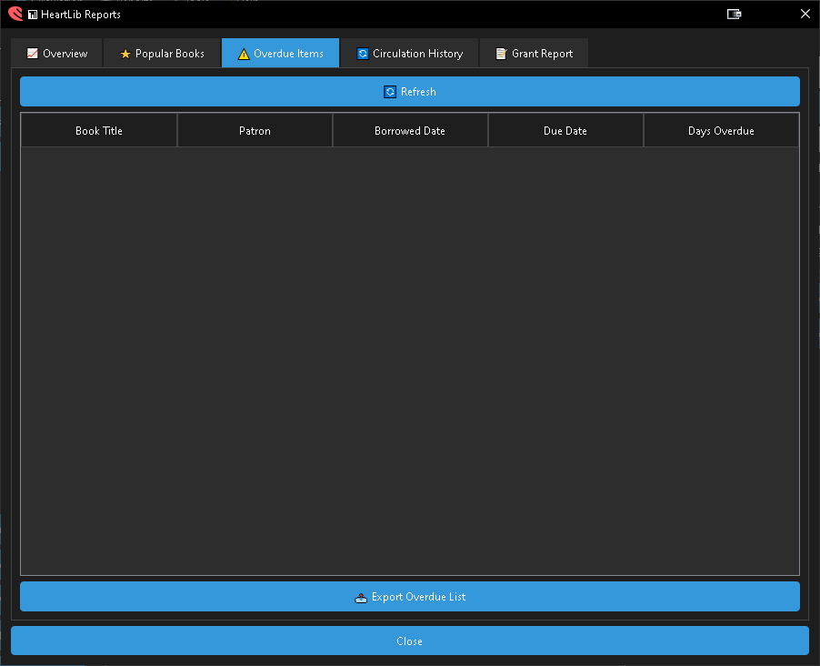</td>
    </tr>
    <tr>
        <td>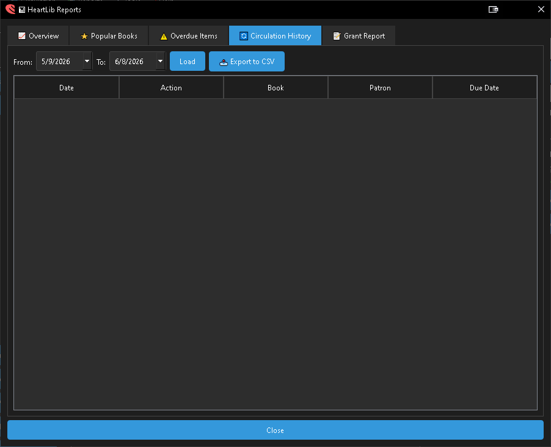</td>
        <td>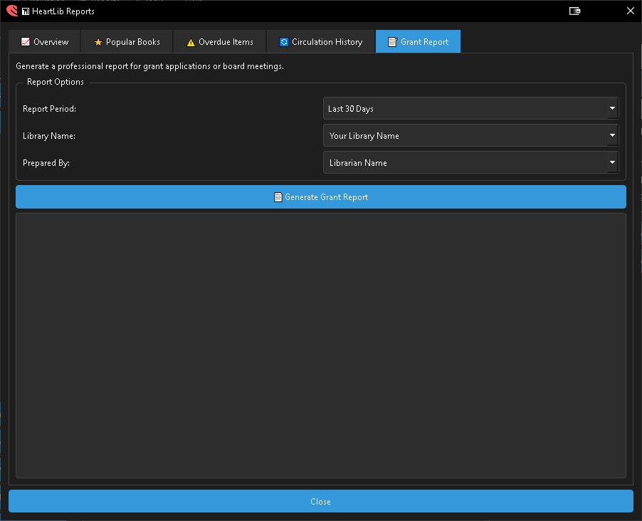</td>
    </tr>
    <tr>
        <td>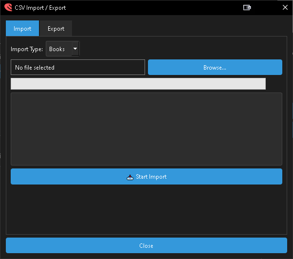</td>
        <td>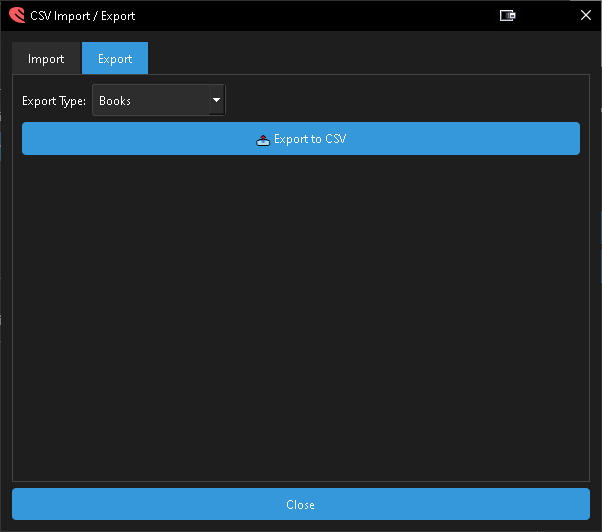</td>
    </tr>
    <tr>
        <td>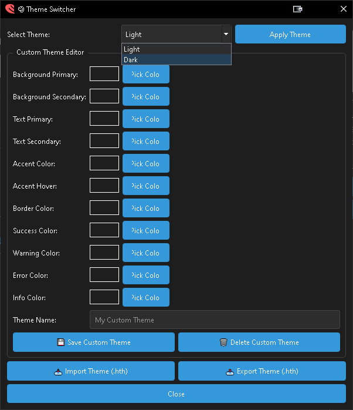</td>
        <td>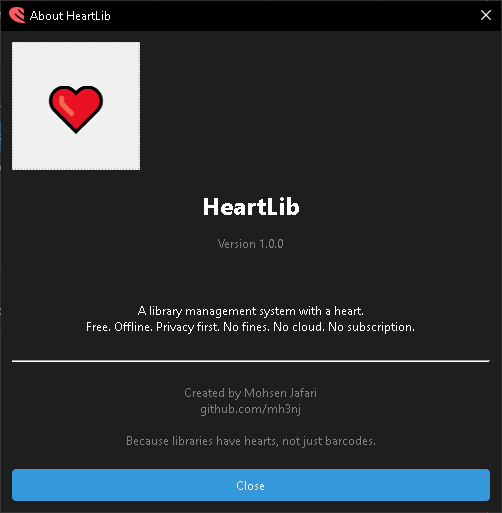</td>
    </tr>
    <tr>
        <td>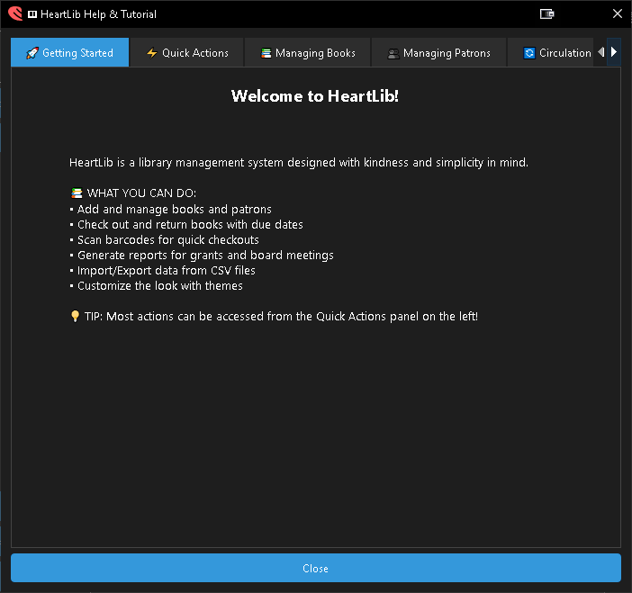</td>
        <td>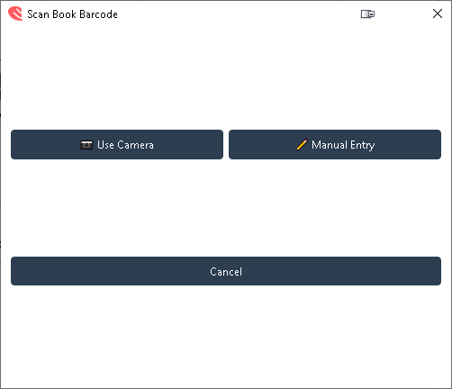</td>
    </tr>
    <tr>
        <td>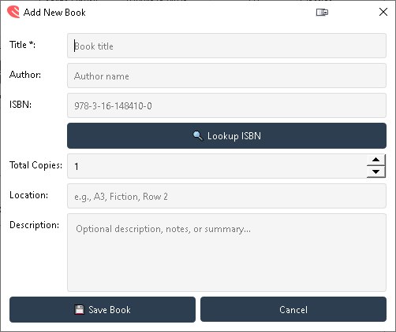</td>
        <td>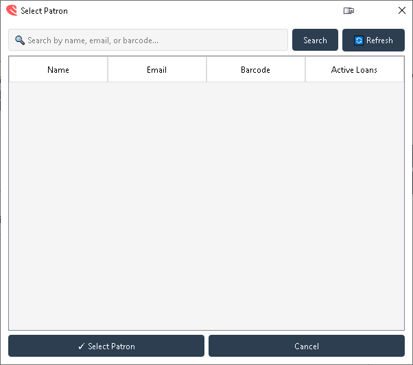</td>
    </tr>
    <tr>
        <td>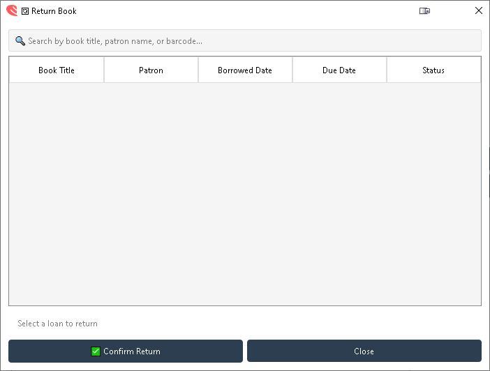</td>
    </tr>
</table>


## getting started

### windows

download `setup_and_run.bat` and double click it.

the script checks your python version, creates a virtual environment, installs dependencies, and launches heartlib. if something is missing, it tells you exactly what and where to get it.

```
setup_and_run.bat
```

if windows defender flags the script, click more info then run anyway. the script is readable. you can inspect every line before running.

### mac and linux

download `setup_and_run.sh`, make it executable, and run it.

```bash
chmod +x setup_and_run.sh
./setup_and_run.sh
```

same as the windows version. checks python, sets up the environment, installs dependencies, launches heartlib.

### manual setup if you prefer

```bash
git clone https://github.com/mh3nj/heartlib.git
cd heartlib
python -m venv .venv

# windows
.venv\Scripts\activate
# mac and linux
source .venv/bin/activate

pip install -r requirements.txt
python main.py
```

### requirements

python 3.10 or higher. 4gb ram recommended. works fully offline after initial setup. internet only needed for installing dependencies and optional isbn lookup.


## first run

when you launch heartlib for the first time, the database is created automatically with sample books. you will see the main window with five panels.

on the left, patron spotlight and quick actions. in the middle, search results and circulation feed. on the right, details panel.

click add book to start building your catalog. click add patron from the patrons menu to register members. use switch patron to select a patron before checking out books.

your data stays on your computer. no account creation. no email verification. no cloud sync unless you enable it yourself.


## keyboard shortcuts

| shortcut | action |
|----------|--------|
| ctrl+1 | focus patron spotlight |
| ctrl+2 | focus search results |
| ctrl+3 | focus circulation feed |
| ctrl+4 | focus details panel |
| ctrl+n | add new book |
| ctrl+p | add new patron |
| ctrl+shift+c | open checkout dialog |
| ctrl+shift+r | open return dialog |
| ctrl+s | manual sync |
| ctrl+shift+s | scan barcode |
| ctrl+comma | open settings |
| ctrl+h | open help |
| ctrl+t | open theme switcher |
| f5 | refresh data |


## project structure

```
heartlib/
├── main.py                      # entry point
├── config.py                    # settings manager
├── requirements.txt             # dependencies
├── setup_and_run.bat            # windows launcher
├── setup_and_run.sh             # mac and linux launcher
├── gui/                         # desktop interface (17 files)
│   ├── quick_actions.py
│   ├── search_results.py
│   ├── patron_spotlight.py
│   ├── circulation_feed.py
│   ├── details_panel.py
│   ├── add_book_dialog.py
│   ├── add_patron_dialog.py
│   ├── patron_search_dialog.py
│   ├── checkout_dialog.py
│   ├── return_dialog.py
│   ├── barcode_scanner.py
│   ├── csv_import_export.py
│   ├── reports_dashboard.py
│   ├── theme_manager.py
│   ├── theme_dialog.py
│   ├── settings_dialog.py
│   └── help_dialog.py
├── database/                    # data layer
│   ├── db_manager.py
│   ├── models.py
│   ├── crud.py
│   └── sync_engine.py
├── networking/                  # sync and api
│   ├── sync_server.py
│   ├── sync_client.py
│   ├── discovery.py
│   └── api_server.py
├── utils/                       # helpers
│   ├── logger.py
│   ├── backup.py
│   ├── isbn_lookup.py
│   ├── camera_batch.py
│   └── emailer.py
├── pwa/                         # patron portal
│   ├── index.html
│   ├── manifest.json
│   └── sw.js
├── resources/                   # icons and themes
└── tests/                       # test files
```


## dependencies

```
pyqt6>=6.5.0          # desktop interface
opencv-python>=4.8.0  # barcode scanning
pyzbar>=0.1.9         # barcode decoding
requests>=2.31.0      # isbn lookup (optional)
flask>=2.3.0          # pwa api server
flask-cors>=4.0.0     # cross origin requests
cryptography>=41.0.0  # encryption (future)
pillow>=10.0.0        # image processing
```


## known limitations

barcode scanning requires a camera. on computers without a camera, manual entry is available.

sync requires all devices to be on the same local network. the server computer must be running for clients to sync.

the full hibp database for breach detection is not included due to size. heartlib does not currently include password breach detection, but the architecture supports adding it.

isbn lookup requires an internet connection and uses the openlibrary api. it works but is rate limited.


## development context

this project was built under internet restrictions in iran. access to github, pypi, stack overflow, and most development resources was blocked during extended periods. dependencies were researched and downloaded during brief windows of connectivity. documentation was consulted from locally cached copies. problems were solved from first principles when references were unavailable.

version control pushes, dependency management, and documentation access required planning around unpredictable connectivity. the application was built anyway. it works. it is documented. it can be cloned and run by anyone.


## about the author

mohsen jafari is a full time developer based in iran, with experience in frontend development, backend systems, and desktop applications. heartlib was built to solve a real need: library software that does not cost money, does not track patrons, and treats librarians with respect.

github: [github.com/mh3nj](https://github.com/mh3nj)
xing: [xing.com/profile/Mohsen_Jafari093223](https://www.xing.com/profile/Mohsen_Jafari093223/)
logo design: [parsegan.com](https://parsegan.com)
portfolio: [dahgan.com](https://dahgan.com)


## license

mit license. use it, fork it, modify it, ship it. attribution appreciated but not required.


## the story behind this

this project was built during a period when the internet in iran was heavily restricted.

no stack overflow. no pypi. no github. no youtube tutorials. no reliable connection to the tools most developers take for granted. just whatever was cached locally, whatever could be reasoned through from first principles, and the determination to ship something real.

eight days of focused work. seventy five hours. eight thousand lines of python code. fifteen hundred lines of pwa code. one developer.

it works. it is useful. it was built under conditions that would have stopped most projects before they started.

heartlib because libraries have hearts, not just barcodes.

mh3nj
